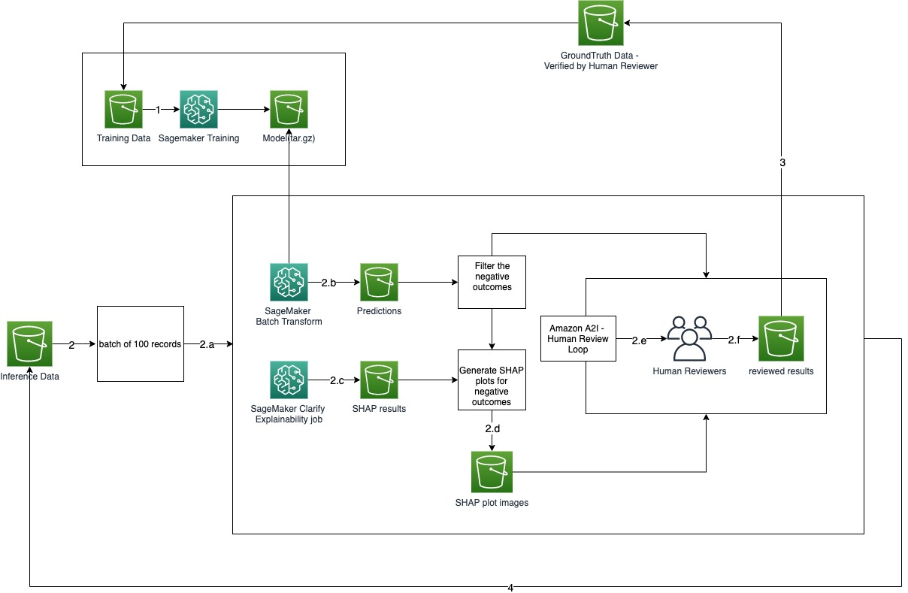

## amazon-sagemaker-clarify-a2i-sample

This repository contains a sample jupyter notebook showing how to use Amazon SageMaker Clarify and Amazon A2I together in a single inference pipeline to improve transparency in machine learning solutions.

The notebook will walk you through a step-by-step process to:    
- Use Amazon SageMaker Clarify for explaining the model predictions using SHAP values    
- Use Amazon A2I to review the individual predictions with the help of SHAP values generated by SageMaker Clarify in the previous step 

## Questions

Please contact [@vikeshpandey](https://twitter.com/vikesh_k_pandey) or raise an issue on this repository.

## Security

See [CONTRIBUTING](CONTRIBUTING.md#security-issue-notifications) for more information.

## License

This library is licensed under the MIT-0 License. See the LICENSE file.

